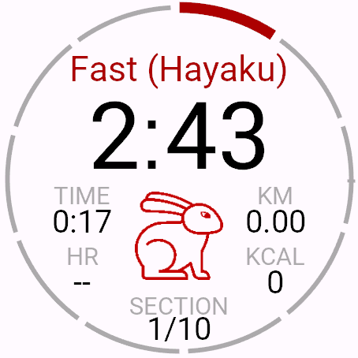
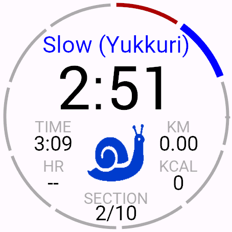
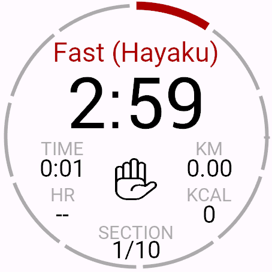
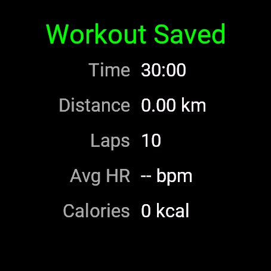
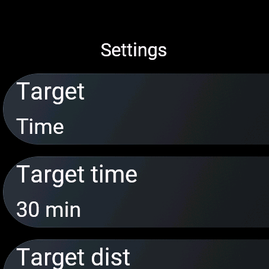

# Japanese Walking

Japanese Walking is a Garmin Connect IQ watch app for Japanese-style interval walking: alternating fast and slow walking blocks with a clear watchface layout and saved FIT activity recording.

## Features

- Alternating fast and slow walking intervals
- Large countdown timer with clear phase icon
- Section ring progress around the watch edge
- Live workout metrics for time, distance, heart rate, and calories
- Saved FIT activity with route support when GPS is available

## Device Support

The manifest currently targets recent Garmin watch families including Venu, vivoactive, Forerunner, and fēnix models.

## Screenshots

Main workout states and menus:

### Fast Interval



### Slow Interval



### Paused Workout



### Workout Complete



### Settings



## Development

### Prerequisites

- [Garmin Connect IQ SDK](https://developer.garmin.com/connect-iq/sdk/) (add `bin/` to your `PATH`)
- A developer signing key (one-time setup — see below)
- **VS Code** with the [Monkey C extension](https://marketplace.visualstudio.com/items?itemName=garmin.monkey-c) *(recommended)*, or any text editor

#### Generate a developer key (one-time)

```bash
openssl genrsa -out developer_key.pem 4096
openssl pkcs8 -topk8 -inform PEM -outform DER -in developer_key.pem -out developer_key.der -nocrypt
```

Keep `developer_key.pem` private. The `.der` file is used for signing builds.

---

### Build

#### VS Code

1. Open the **`JapaneseIntervalWalking/`** sub-folder directly (**File → Open Folder** and select that folder, not the parent). The Monkey C extension resolves `monkey.jungle` relative to the workspace root and will report *"Connect IQ project not found"* if the wrong folder is open.
2. Press **Ctrl+Shift+B** (or run **Monkey C: Build for Device** from the command palette).
3. Select your target device when prompted.
4. The compiled `.prg` is written to `bin/`.

#### Command line

```bash
monkeyc \
  -f monkey.jungle \
  -o bin/JapaneseIntervalWalking.prg \
  -y /path/to/developer_key.der \
  -d venu445mm
```

Replace `venu445mm` with any device ID listed in `manifest.xml`. Run `monkeyc --devices` to list all SDK-supported devices.

---

### Run in the simulator

#### VS Code

Press **F5** (or **Monkey C: Run in Simulator** from the command palette), then select a target device. VS Code launches the Connect IQ simulator automatically and deploys the app.

#### Command line

```bash
# 1. Start the simulator (leave it running)
connectiq &

# 2. Build and push to the simulator
monkeyc \
  -f monkey.jungle \
  -o bin/JapaneseIntervalWalking.prg \
  -y /path/to/developer_key.der \
  -d fenix7 \
  --simulator
```

The app appears in the simulator's app list. Use the simulator's GPS simulation panel to test distance-based workouts.

---

### Export a release `.iq` for the Connect IQ Store

#### VS Code (recommended)

1. Open the command palette (`Ctrl+Shift+P`) and run **Monkey C: Export Project**.
2. Select target devices (or choose all).
3. The signed `.iq` file is written to `bin/`.

#### Command line

```powershell
& "C:\Program Files\Eclipse Adoptium\jdk-21.0.11.10-hotspot\bin\java.exe" `
  -jar "$env:APPDATA\Garmin\ConnectIQ\Sdks\connectiq-sdk-win-9.1.0-2026-03-09-6a872a80b\bin\monkeybrains.jar" `
  -o bin\JapaneseIntervalWalking.iq `
  -f monkey.jungle `
  -y developer_key `
  -r
```

The `-r` flag produces a release build. Upload `bin\JapaneseIntervalWalking.iq` to the [Connect IQ Developer Portal](https://developer.garmin.com/connect-iq/developer-portal/).

---

### Install on a physical watch

1. Build the `.prg` for your specific watch model (e.g. `-d fr265`).
2. Connect the watch to your computer via USB.
3. Copy the compiled file to the watch:

```
GARMIN/APPS/JapaneseIntervalWalking.prg
```

4. Safely eject the watch. The app appears in the watch's Connect IQ app list immediately.

> **Tip:** The watch model in the `-d` flag must match your physical device exactly, or the app will not appear. Check your device's model string in the Connect IQ SDK device list or in `manifest.xml`.

---

## Support

If the app is useful, a small donation or tip is appreciated and helps justify continued polish, testing, and device support.

[](https://www.paypal.me/cyberjunkynl/)
[](https://github.com/sponsors/cyberjunky)

- Star this repository
- [Report issues](https://github.com/cyberjunky/japanese-interval-walking/issues)
- Share with other Garmin users

## Notes

- The FIT activity is saved with the name `Japanese Walking`. If Garmin Connect's **auto-name** setting is enabled (the default), it will rename the activity to `[Location] Walking` — the sport type name (`Walking`) comes from the Garmin platform and cannot be overridden from within the app. To keep the `Japanese Walking` name, disable auto-naming in Garmin Connect: **Profile & Settings → Activity Settings → Auto-name Activities**.
- GPS is enabled during workouts to improve saved route and map data.
